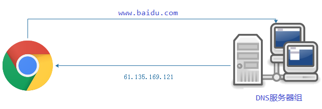
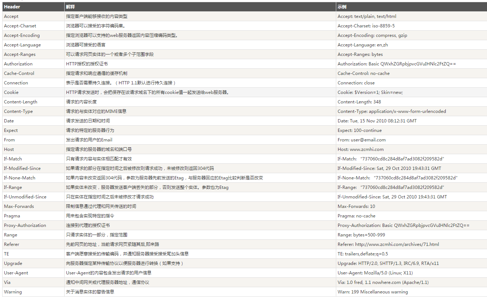
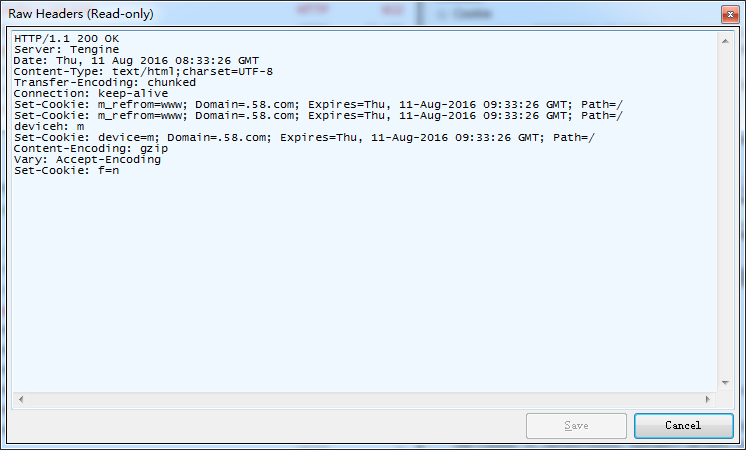
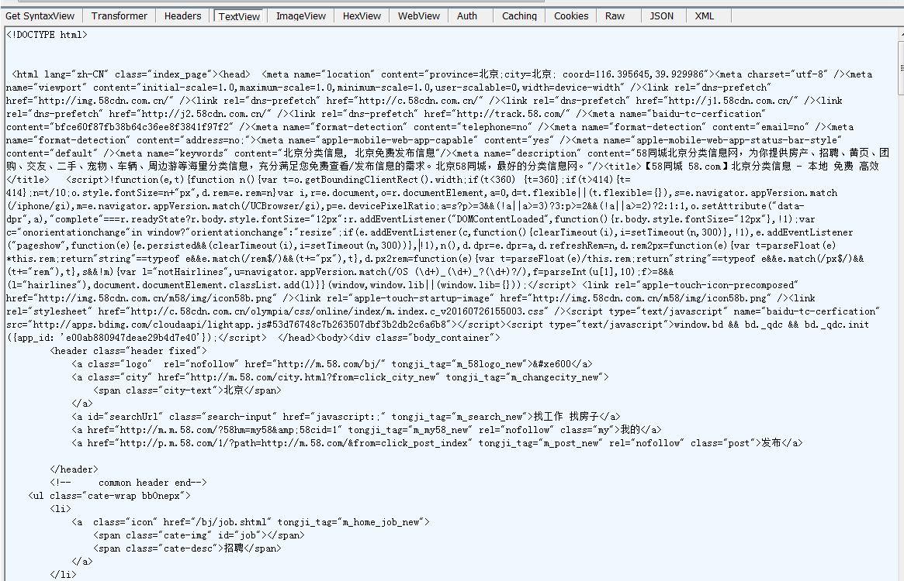

## 浏览器从输入网址到显示都发生了些什么？


### 1、输入网址


输入网址有啥好说的......

### 2、浏览器查找域名的IP地址

这个过程呢其实就是应用层DNS解析的过程，上图：



DNS的查找有以下过程：

1. **浏览器缓存**：浏览器会在一定时间内缓存DNS记录（2min-30min不等）
2. **系统缓存**：操作系统也会缓存一定的DNS记录。浏览器缓存找不到的时候会查找系统里的缓存记录。
3. **路由器缓存**：请求经过路由器时候，也会读取路由器的缓存。
4. **ISP DNS 缓存**：检查ISP缓存DNS的服务器，查询缓存记录。
5. **递归搜索**:DNS服务器从根域名开始进行递归搜索。一般DNS服务器的缓存中会有.com域名服务器中的域名，所以到顶级服务器的匹配过程不是那么必要了。

	

DNS查找时有一系列的优化方法：

1. **循环DNS**-----返回多个IP地址
2. **负载均衡器**-----是以一个特定IP地址进行侦听并将网络请求转发到集群服务器上的硬件设备。
3. **地理DNS**-----根据用户所处的地理位置,映射同一个域名到不同的IP地址，提高扩展性。
4. **使用Anycast**-----一个IP地址映射多个物理主机的路由技术。大多数DNS服务器使用Anycast来获得高效低延迟的DNS查找。


### 3、向web服务器发送HTTP请求

应用层客户端会发送一个HTTP请求，内容如下：

```
	GET/sample.jspHTTP/1.1
 
	Accept:image/gif.image/jpeg,*/*
	Accept-Language:zh-cn
	Connection:Keep-Alive
	Host:localhost
	User-Agent:Mozila/4.0(compatible;MSIE5.01;Window NT5.0)
	Accept-Encoding:gzip,deflate
 	
	username=jinqiao&password=1234
```

这里的请求头包含三个部分：

- 请求的URI协议/版本
	
	其中"GET"代表请求方法，HTTP1.1目前支持7种请求方法：

		- GET      请求获取由Request-URI所标识的资源。
		- POST     在Request-URI所标识的资源后附加新的数据。
		- HEAD     请求获取由Request-URI所标识的资源的响应消息报头。
		- OPTIONS  请求查询服务器的性能，或查询与资源相关的选项和需求。
		- PUT      请求服务器存储一个资源，并用Request-URI作为其标识。
		- DELETE   请求服务器删除由Request-URI所标识的资源。
		- TRACE    请求服务器回送收到的请求信息，主要用语测试或诊断。

	"/sample.jsp"表示URI。URI完整地指定了要访问的网络资源，通常只要给出相对于服务器的根目录的相对目录即可，因此总是以“/”开头

	"HTTP/1.1"表示协议和协议的版本

- 请求头(Request Header)
	
	请求头包含许多有关的客户端环境和请求正文的有用信息。如返回的信息是否需要缓存，以及客户端是否发送cookie等。
	
	

- 请求正文
	
	请求头和请求正文之间是一个空行，这个行非常重要，它表示请求头已经结束，接下来的是请求正文。请求正文中可以包含客户提交的查询字符串信息：
	username=jinqiao&password=1234


### 4、传输层通过TCp协议传输报文

这个过程则是TCP连接的三次握手过程：


### 5、网络层IP协议查询MAC地址

IP协议的作用是把TCP分割好的各种数据包传送给接收方。

而要保证确实能传到接收方还需要接收方的MAC地址，也就是物理地址。IP地址和MAC地址是一一对应的关系，一个网络设备的IP地址可以更换，但是MAC地址一般是固定不变的。

ARP协议可以将IP地址解析成对应的MAC地址。

当通信的双方不在同一个局域网时，需要多次中转才能到达最终的目标，在中转的过程中需要通过下一个中转站的MAC地址来搜索下一个中转目标。

### 6、数据链路层传输

客户端找到对方IP对应的MAC地址后，就把数据发送到数据链路层传输。这时，客户端发送请求的过程的阶段才结束。

### 7、服务端接收数据

接收端的服务器在链路层接收到数据包，再层层向上直到应用层。这过程中包括在运输层通过TCP协议讲分段的数据包重新组成原来的HTTP请求报文。

### 8、服务端处理请求

服务器接收到获取请求，然后处理并返回一个响应。

服务器通过Web服务器软件（如Apache，nodeJs等）处理请求得到其中的资源路径，查询字符串，然后根据路径进行路由匹配，再调用各种数据服务，根据模板文件组装成一个实际的HTML字符串文件。

### 9、服务端返回一个HTTP响应请求

返回的请求头：



内容编码头告诉浏览器整个响应体用gzip算法进行压缩。解压blob块后，你可以看到如下期的HTML：



通常，响应头会设置Content-Type,charset,缓存设置，cookie等信息。


### 10、浏览器开始渲染拿到的HTML文件

HTML文件还没完整的接受到的时候，就开始显示这个页面了，一般最先开始显示的就是HTML中的纯DOM结构。

### 11、浏览器发送并获取嵌入到HTML文档里边的对象

这些对象其实就是浏览器解析到的CSS文件，JS文件，图片和其它一些资源。这些资源的获取都要重新经历HTML文件获取的过程。

但这仅限于第一次完全没有缓存的情况下加载页面。如果静态资源文件已经由浏览器缓存，则不需要和服务端进行通信了，而是直接读取缓存文件。

服务端响应中一般包含了静态文件的保存期限。而且，每个响应都有可能包含一个ETag头（被请求变量的实体值），如果浏览器观察到文件的版本 ETag信息已经存在，就马上停止这个文件的传输。

静态文件一般是缓存到CDN服务器上的，它们的内容往往代表着站点的带宽大小。通常站点会使用第三方的CDN。所以，当你每次请求一个静态文件的时候，你可能会发现每一次的IP地址都出现了变化。

### 12、浏览器的异步请求(AJAX)

页面显示完成后客户端仍与服务器端保持着联系。

浏览器执行JavaScript，可能会进行一些异步的操作，这个模式就是AJAX，也就是JavaScript向服务器发送一系列的异步请求，从而更新页面上的局部区域，从而达到动态网站的效果。


至此，所有的准备工作都已做好，你就可以开始和网页进行交互了！


### 总结一下

当在浏览器地址栏输入网址到显示页面，这整个过程大致分为两个部分：

- 网络通信（建立连接，发送接收请求数据）
- 页面渲染（浏览器解析渲染）


### 参考链接

[http://igoro.com/archive/what-really-happens-when-you-navigate-to-a-url/](http://igoro.com/archive/what-really-happens-when-you-navigate-to-a-url/)

[http://www.nowamagic.net/academy/detail/48110180](http://www.nowamagic.net/academy/detail/48110180)


